# StratoSort Core — End-to-End Walkthrough

A visual guide to every screen and feature in StratoSort Core, captured from the production
Linux AppImage (v2.0.4). Each section maps to one phase of the app workflow.

> **Platform shown:** Ubuntu Linux, AppImage distribution
> **Launch command:** `./StratoSortCore-2.0.4-linux-x86_64.AppImage`

---

## Table of Contents

1. [First Launch & Model Setup](#1-first-launch--model-setup)
2. [Welcome Phase](#2-welcome-phase)
3. [Setup Phase — Smart Folders](#3-setup-phase--smart-folders)
4. [Discover Phase — File Analysis](#4-discover-phase--file-analysis)
5. [Organize Phase — Review & Execute](#5-organize-phase--review--execute)
6. [Complete Phase — Summary](#6-complete-phase--summary)
7. [Search & Knowledge OS](#7-search--knowledge-os)
8. [Settings — Full Reference](#8-settings--full-reference)
9. [Videos](#9-videos)
10. [Video Transcripts (VoiceOver)](#video-transcripts-voiceover)

---

## 1. First Launch & Model Setup

On first launch, StratoSort checks for AI models in `~/.config/StratoSort Core/models/` (via
`app.getPath('userData')`). If required models are missing, a setup wizard guides you through
downloading them.

### Model Selection

The wizard presents installation profiles and lets you choose which models to install:

| Model Type | Purpose | Required? |
|:-----------|:--------|:----------|
| **Embedding Model** (Nomic Embed Text v1.5) | Converts text to vectors for semantic search | Yes |
| **Text Analysis Model** (Qwen / Llama) | Analyzes documents and generates descriptions | Yes |
| **Vision Model** (LLaVA) | Analyzes images and screenshots | Optional |

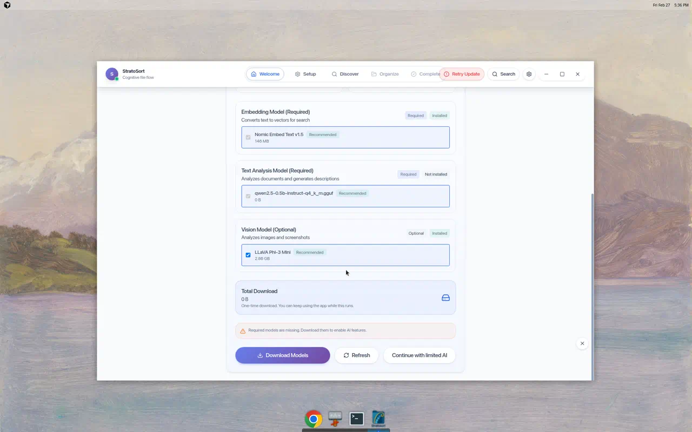
<!-- Video: ../e2e-videos/03_discover_analysis_and_model_setup.mp4 -->

The wizard shows installation status for each model (Installed / Not installed) with download
size estimates. Three action buttons are available:

- **Download Models** — begins downloading selected models
- **Refresh** — re-checks local model availability
- **Continue with limited AI** — skips setup and enters the app immediately

### Download Progress

During download, you see per-model progress bars with download speed and completion percentage.
You can continue using the app while models download in the background.

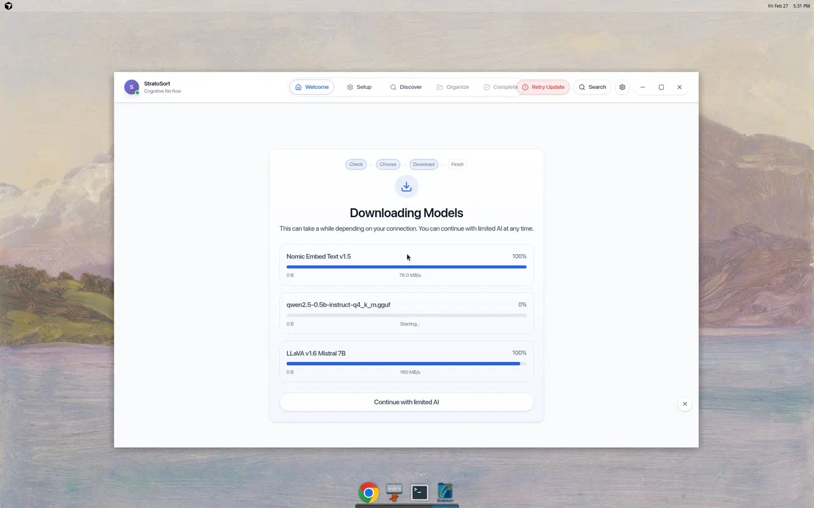

---

## 2. Welcome Phase

After model setup (or if models are already present), you land on the Welcome screen.

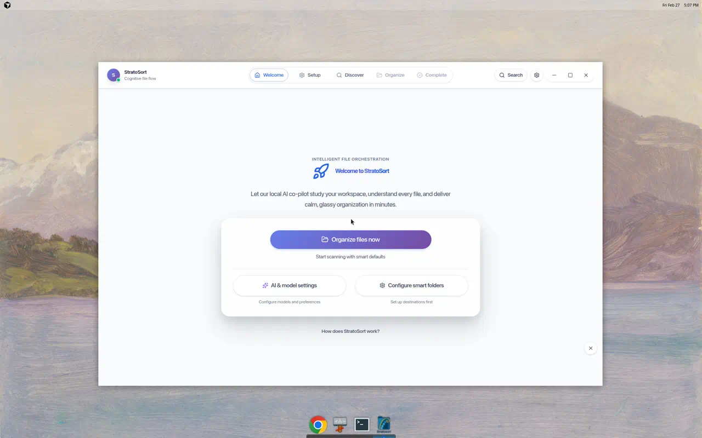

### Navigation Bar

The top bar is always visible and contains:
- **StratoSort logo** with connection status indicator (green = AI engine ready)
- **Phase tabs:** Welcome → Setup → Discover → Organize → Complete
- **Search button** — opens the floating search widget / Knowledge OS
- **Settings gear** — opens the configuration panel
- **Window controls** — minimize, maximize, close

### Welcome Actions

| Action | What It Does |
|:-------|:-------------|
| **Organize files now** | Jumps straight to Discover with smart defaults |
| **AI & model settings** | Opens the Settings panel to the AI Configuration section |
| **Configure smart folders** | Goes to the Setup phase |
| **How does StratoSort work?** | Opens a modal explaining the 3-step flow |

### How StratoSort Works Modal

Clicking "How does StratoSort work?" reveals the three core steps:


1. **Discover** — Drop folders, run system scans, or watch Downloads automatically
2. **Analyze** — Local AI reads file contents, context, and prior choices
3. **Organize** — Approve suggestions, rename intelligently, undo instantly

---

## 3. Setup Phase — Smart Folders

Smart Folders are the destinations the AI uses to organize your files. Each folder has a
name, path, and description that the AI reads to decide where files belong.


### Default Folder

A default "Uncategorized" folder is created at `~/StratoSort/Uncategorized` for files that
don't match any other folder.

### Adding a Smart Folder

Click **+ Add Folder** to open the Add Smart Folder dialog:


| Field | Description |
|:------|:------------|
| **Folder Name** (required) | Display name — e.g., "Invoices", "Photos", "Projects" |
| **Target Path** (optional) | Filesystem path. Auto-fills based on name and default location |
| **Description** | Plain-language description of what files belong here. The AI uses this to match files. |

The **Generate with AI** button can auto-create a description based on the folder name.

### Tips

- Create folders around real outcomes: `Invoices`, `Receipts`, `Screenshots`, `Contracts`
- Write descriptions as if telling a coworker what goes in each folder
- You can edit or delete folders anytime
- **Reset to Defaults** restores the default folder set
- At least one folder is required before continuing

Click **Continue to Discovery** when finished.

---

## 4. Discover Phase — File Analysis

This phase is where you add files for AI analysis. StratoSort reads file contents, extracts
meaning, and generates organization suggestions.


### Adding Files

Two methods to add files:

#### Select Files
Opens a file picker. Navigate to any directory, select individual files or use Ctrl+A to
select all, then confirm.


#### Scan Folder
Opens a folder picker. Select any directory and StratoSort automatically discovers all
supported files within it.

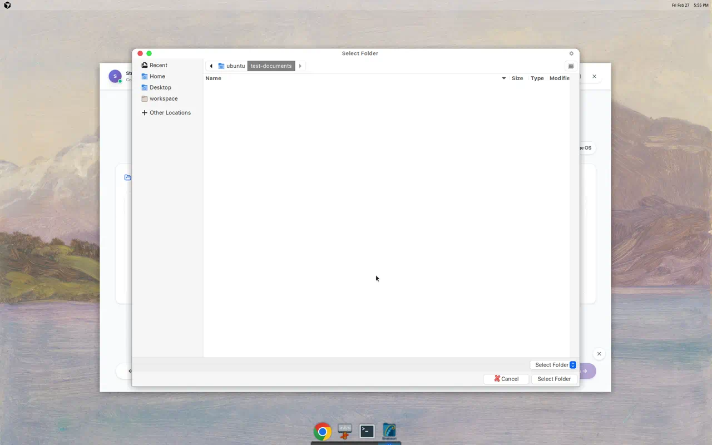

### Analysis Progress

Once files are added, AI analysis begins automatically:


The progress bar shows:
- **File counter** — "Analyzing X of Y" with percentage
- **Current file** — which file is being processed
- **Stop Analysis** button — halt processing at any time

Toast notifications confirm actions:
- "Added N new files for analysis"
- "Starting AI analysis of N files..."

### Analysis Complete

When analysis finishes, a completion banner appears with:

- Green status dot with "Analysis complete · 5 ready"
- Toast notification: "Analysis complete! 5 files ready"
- Results summary: "5 successful, 0 failed"
- **Clear Queue** button to reset

The app automatically advances to the Organize phase once analysis is done.

### Naming Strategy

Click **Naming Strategy** in the upper right to configure how files are renamed:

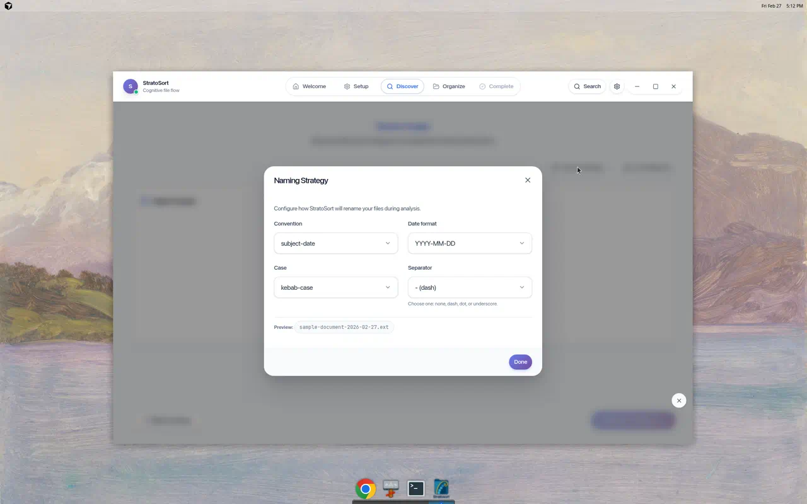

| Setting | Options | Default |
|:--------|:--------|:--------|
| **Convention** | subject-date, date-subject, subject-only | subject-date |
| **Date Format** | YYYY-MM-DD, MM-DD-YYYY, DD-MM-YYYY | YYYY-MM-DD |
| **Case** | kebab-case, snake_case, camelCase, Title Case | kebab-case |
| **Separator** | dash, dot, underscore, none | dash |

A live **Preview** shows the resulting filename format.

### Knowledge OS Panel

Click **Knowledge OS** to open the semantic search and relationship panel:


Three tabs are available:
- **Discover** — Search your files using natural language
- **Understand** — View document summaries and extracted concepts
- **Relate** — Explore relationships between files via the Knowledge Graph

The panel requires file embeddings. Click **Build File Embeddings** to generate the vector
index from your analysis history.

---

## 5. Organize Phase — Review & Execute

After analysis, the Organize phase shows AI-generated suggestions for each file. You review
and approve where each file should be moved and what it should be renamed to.

> **Note:** The Organize tab is only accessible after files have been analyzed in the
> Discover phase. Navigation is enforced — the tab shows a count badge and a tooltip
> explaining why it may be disabled.

### File Grid with AI Suggestions

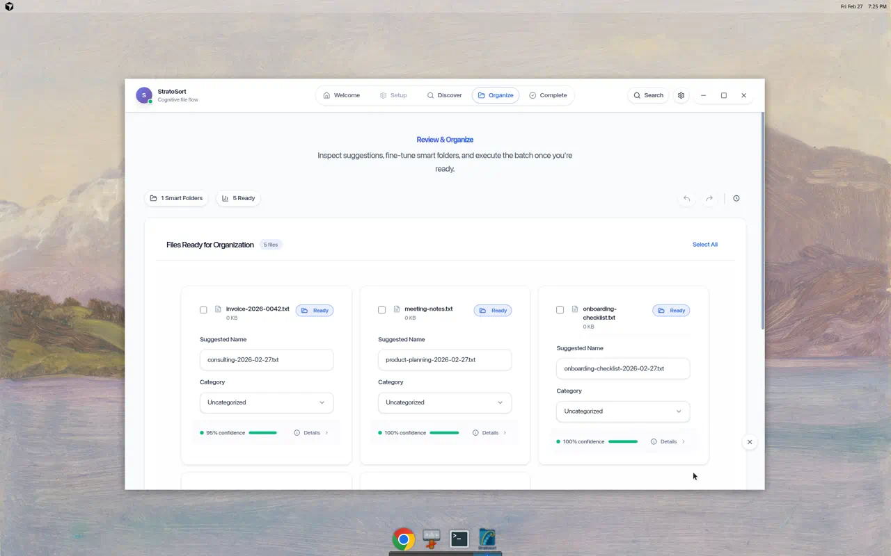

Each file card shows:
- **Original filename** with "Ready" badge
- **Suggested Name** — AI-generated filename following your naming convention
- **Category** dropdown — editable destination folder
- **Confidence level** — color-coded percentage (green = high)
- **Details** link — view the full AI analysis

Example AI suggestions from a real analysis:

| Original File | Suggested Name | Confidence |
|:-------------|:---------------|:-----------|
| invoice-2026-0042.txt | consulting-invoice-2026-02-27.txt | 100% |
| meeting-notes.txt | product-plan-session-notes-2026-02-27.txt | 95% |
| onboarding-checklist.txt | onboarding-checklist-2026-02-27.txt | 100% |

### Batch Operations

Click **Select All** to check all files, then use:
- **Approve Selected** — Accept AI suggestions for all selected files
- **Bulk Edit** — Change category or name pattern for multiple files at once
- **Deselect All** — Clear the selection

### Additional Features

- **Status Overview** — Summary modal showing ready/pending/conflict counts
- **Conflict Detection** — Highlights files with duplicate destination paths
- **Execute Organization** — Moves and renames files according to approved suggestions
- **Undo/Redo** — Full undo history for all organization operations
- **Processed Files** — History of already-organized files

---

## 6. Complete Phase — Summary

After executing organization, the Complete phase shows a summary of:
- Total files organized
- Destination folders used
- Any errors or conflicts encountered
- Option to start a new session or undo recent changes

---

## 7. Search & Knowledge OS

### Search Widget

Click the **Search** button in the navigation bar to open the floating search widget:

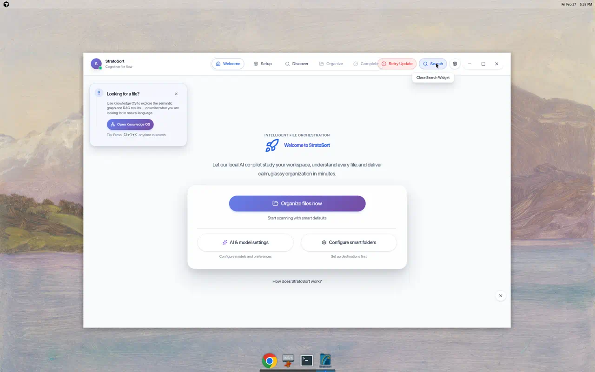

The widget provides:
- Quick explanation of Knowledge OS capabilities
- **Open Knowledge OS** button to launch the full interface
- Keyboard shortcut: **Ctrl+K** from anywhere in the app

### Knowledge OS Full Interface

After files are analyzed and embedded, Knowledge OS shows indexed content:

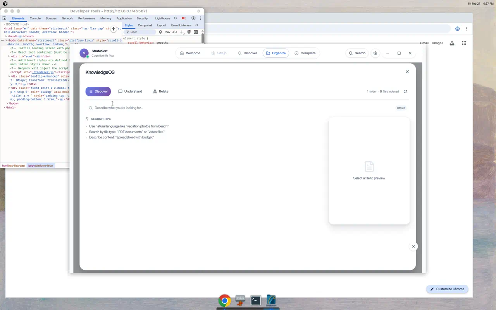

The status bar shows "1 folder · 5 files indexed" confirming embeddings are built. Search
tips guide users on natural language queries.

#### Searching for Files

Type a keyword or natural language description in the search bar:

**Keyword search — "invoice":**

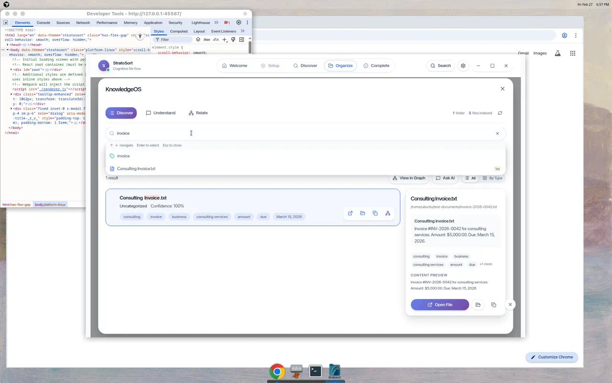

- Found "Consulting Invoice.txt" with 100% confidence
- Tags extracted: consulting, invoice, business, consulting services, amount, due, March 15 2026
- File preview shows full content and path
- Action buttons: View in Graph, Ask AI, filter by Type

**Natural language search — "meeting notes about product planning":**

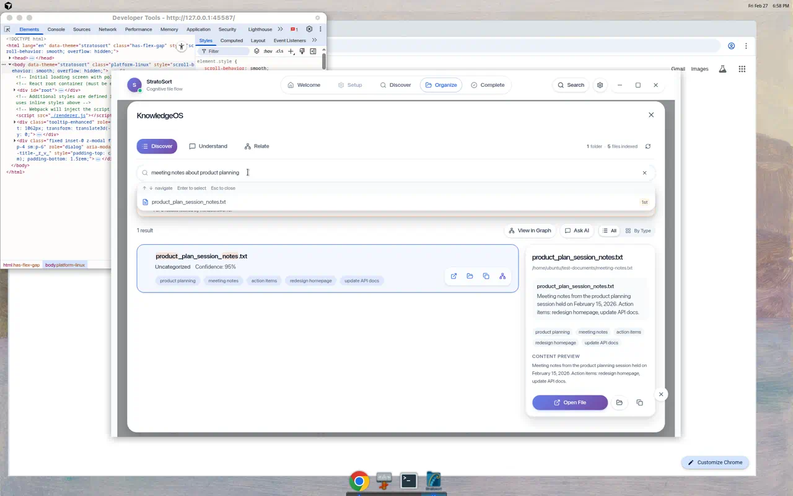

- Found "product_plan_session_notes.txt" with 95% confidence
- Tags: product planning, meeting notes, action items, redesign homepage, update API docs
- Full content preview with original file path
- **Open File** button to launch the file directly

#### Discover Tab (Default)
- **Search bar** — Describe what you're looking for in natural language
- **Results list** — Files ranked by semantic relevance with confidence scores
- **File preview** — Content preview, tags, and actions on the right
- **Status indicators** — Folder count and indexed file count
- **View in Graph** — Visualize relationships between search results

#### Understand Tab — AI Conversational Chat


The Understand tab is a RAG (Retrieval-Augmented Generation) chat interface for asking
questions about your documents in natural language.

Features:
- **New Chat** button to start a conversation
- **Search chats** to find past conversations
- **Chat input** — "Ask a question about your documents (e.g., 'Summarize my tax returns')..."
- **Ctrl+Enter** to send messages

When you ask a question, the AI:
1. Searches your indexed documents for relevant sources
2. Shows "Searching documents..." then "Found N relevant sources..."
3. Generates a contextual answer using the matched content

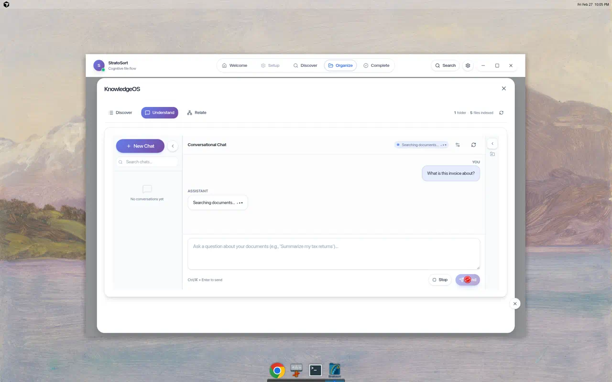


#### Relate Tab — Knowledge Graph Visualization

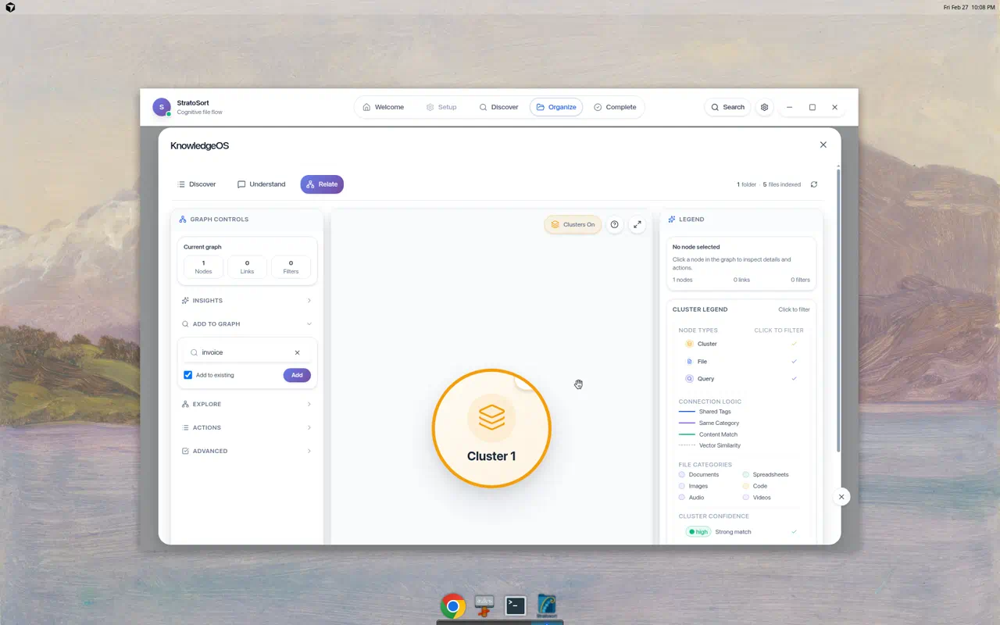

The Relate tab provides an interactive Knowledge Graph for exploring relationships between
your documents. The interface has three panels:

**Left Panel — Graph Controls:**
- **Current graph** stats (Nodes, Links, Filters)
- **Insights** — AI-generated organizational analysis
- **Add to Graph** — Search and add files to the visualization
- **Explore** / **Actions** / **Advanced** sections

**Center — Graph Canvas:**
- Interactive node-link diagram with clusters
- **Clusters On/Off** toggle
- Zoom (+/−) and pan controls
- Double-click clusters to expand into individual files

**Right Panel — Legend & Node Details:**
- Node type legend: Cluster (orange), File (blue), Query (purple)
- Connection types: Shared Tags, Same Category, Content Match, Vector Similarity
- File category colors: Documents, Images, Audio, Spreadsheets, Code, Videos
- Cluster confidence indicators

##### Cluster Exploration

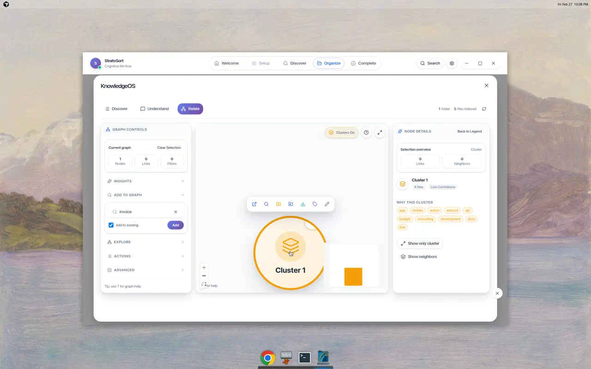

Clicking a cluster shows:
- File count and confidence level
- **WHY THIS CLUSTER** — Common tags/themes across files
- **WHY CONNECTED** — Per-file connection reasons (Related content, Similarity connection)
- **Show only cluster** / **Show neighbors** buttons

##### Expanded Cluster View

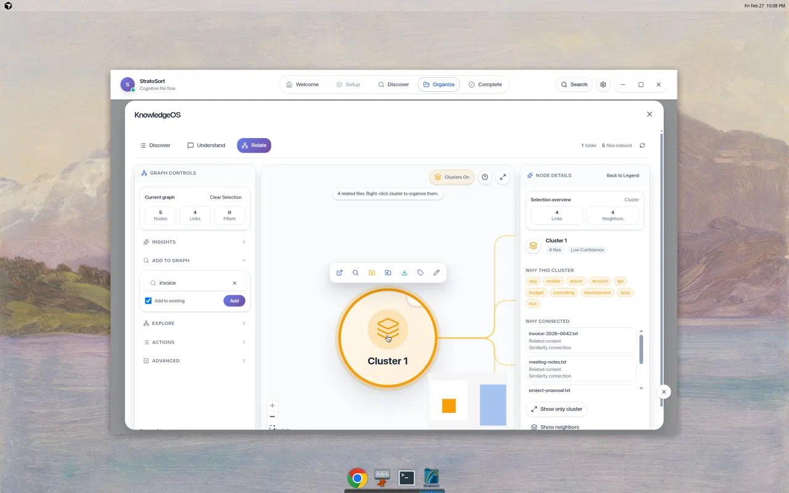

Double-clicking a cluster expands it to show individual file nodes with relationship edges.
The tooltip reads "4 related files. Right-click cluster to organize them."

##### Graph Insights

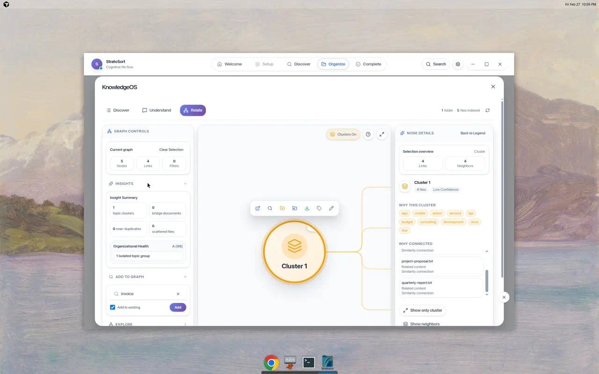

The Insights panel provides organizational health metrics:
- **Topic clusters** count
- **Bridge documents** — files connecting different topic areas
- **Near-duplicates** — potential duplicate files detected
- **Scattered files** — orphan files without clear grouping
- **Organizational Health** score (A through F, with percentage)


### Building the Search Index

Knowledge OS requires embeddings to function. Embeddings are generated automatically during
analysis when "Embedding Timing" is set to "During analysis" (the default). Two manual
rebuild options are also available:
- **Build Folder Embeddings** — Index files in Smart Folders
- **Build File Embeddings** — Index all analyzed files

---

## 8. Settings — Full Reference

Click the **gear icon** (⚙) in the navigation bar to open Settings. The panel is organized
into six collapsible sections.

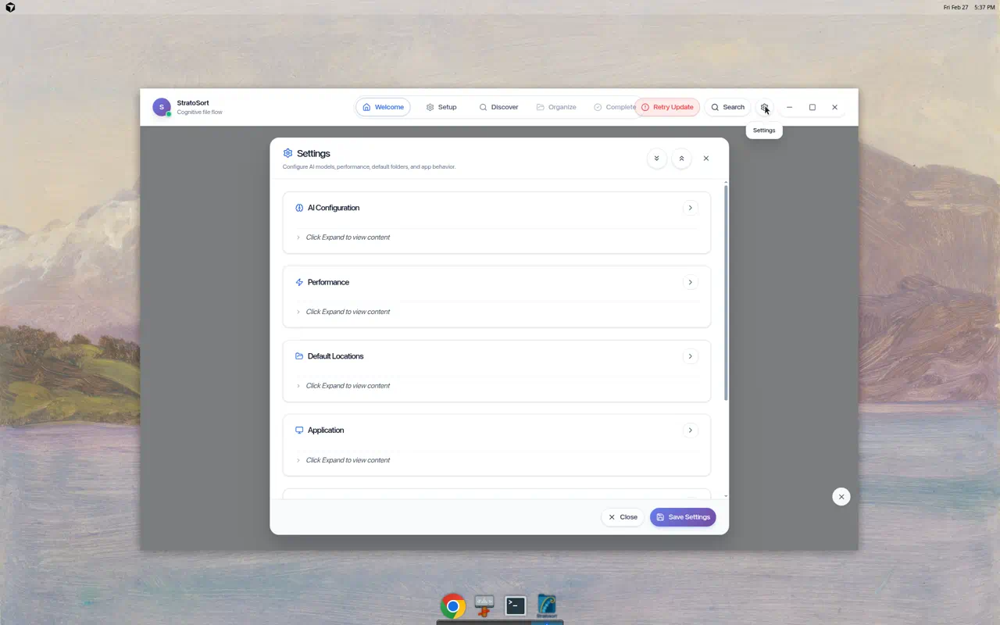

### 8.1 AI Configuration


#### Local AI Engine
- **Status badge** — Shows "Ready (cpu)" or "Ready (gpu)" with model count
- **GPU Acceleration** — Toggle between CPU-only and GPU-accelerated inference
- **Refresh Models** / **View All Models** — Manage available GGUF model files

#### Default AI Models
- **Text Model** — The LLM used for document analysis (e.g., Qwen, Llama)
- **Vision Model** — The model used for image analysis (e.g., LLaVA)
- **Embedding Model** — The model used for vector search (e.g., Nomic Embed)

#### Model Management


Download additional GGUF models by entering the exact filename from the model registry.

#### Embedding Behavior


| Setting | Options | Default |
|:--------|:--------|:--------|
| **Embedding Scope** | All analyzed files, Organized files only | All analyzed files |
| **Embedding Timing** | During analysis, After organization | During analysis |
| **Default Embedding Policy** | Embed locally, Skip | Embed locally |
| **Auto-generate Chunk Embeddings** | On/Off toggle | On |

**Rebuild All Embeddings** — Use after changing embedding models. Preserves analysis data
while regenerating the search index.

### 8.2 Performance


#### Auto-Organize
- **Auto-organize Downloads** — Automatically analyze and organize new files in your
  Downloads folder
- **Smart Folder Routing** — Choose routing strategy:
  - Auto (starts LLM-only, shifts to hybrid as embeddings build)
  - LLM-only
  - Embedding-first
  - Hybrid

#### Background Mode
- **Background Mode** — Keep StratoSort running in the system tray when the window closes

#### Processing Limits
- **Concurrent Analysis** — Maximum simultaneous file analyses (default: 1)
- **Max file sizes** — Separate limits for general files (100 MB), images (100 MB), and
  documents (200 MB)

#### Graph Retrieval


- **Enable Graph Expansion** — Use relationship edges to pull related files into search
  results
- **Graph Expansion Weight** — Slider (0–100%) controlling how much graph neighbors
  influence ranking (default: 20%)
- **Graph Neighbors Limit** — Maximum neighbor files per query (default: 120)
- **Contextual Chunk Expansion** — Use adjacent chunks for more context

### 8.3 Default Locations


- **Default Smart Folder Location** — Base path where new Smart Folders are created
  (default: home directory)
- **Browse** button — Select a different base path

#### File Naming Defaults

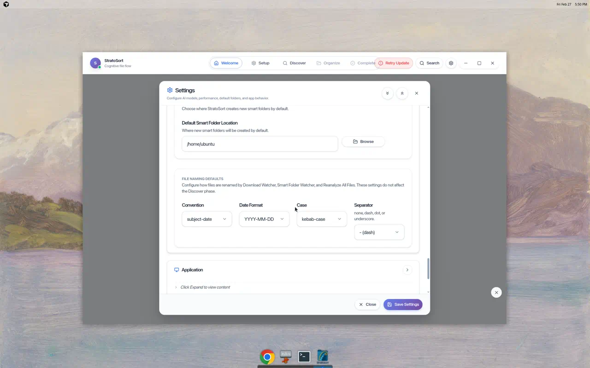

Controls how files are renamed by Download Watcher, Smart Folder Watcher, and Reanalyze All
Files. Same options as the Naming Strategy modal in Discover.

### 8.4 Application


#### Application Preferences
- **Launch on Startup** — Auto-start StratoSort when you log in
- **Software Updates** — Check for new versions with one click

#### Notifications

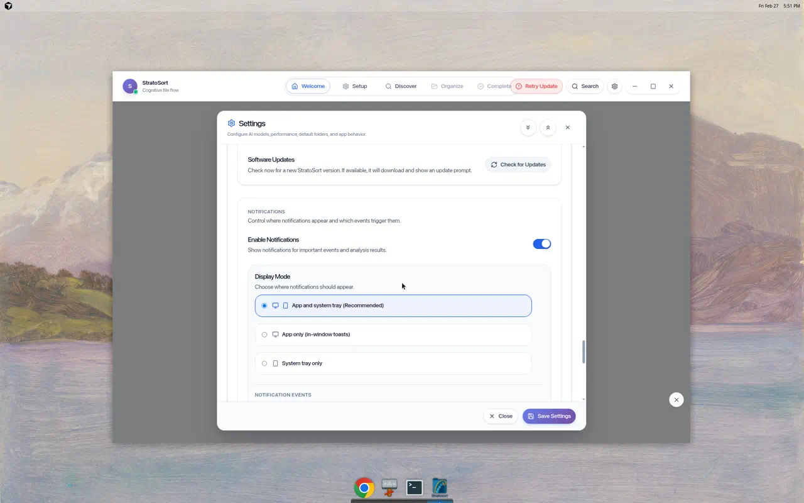

- **Enable Notifications** — Master toggle
- **Display Mode:**
  - App and system tray (Recommended)
  - App only (in-window toasts)
  - System tray only
- **Notification Events:**
  - Auto-analyzed files — Notify when smart folder/download watchers analyze files
  - Low confidence files — Notify when confidence is below the auto-organize threshold

#### Settings Backup & Restore


- **Create Backup** — Save current settings to backup history
- **Export to File** — Export settings as a portable file
- **Import from File** — Restore settings from an export
- **Available Backups** — List of timestamped backups with restore and delete actions

### 8.5 Analysis History

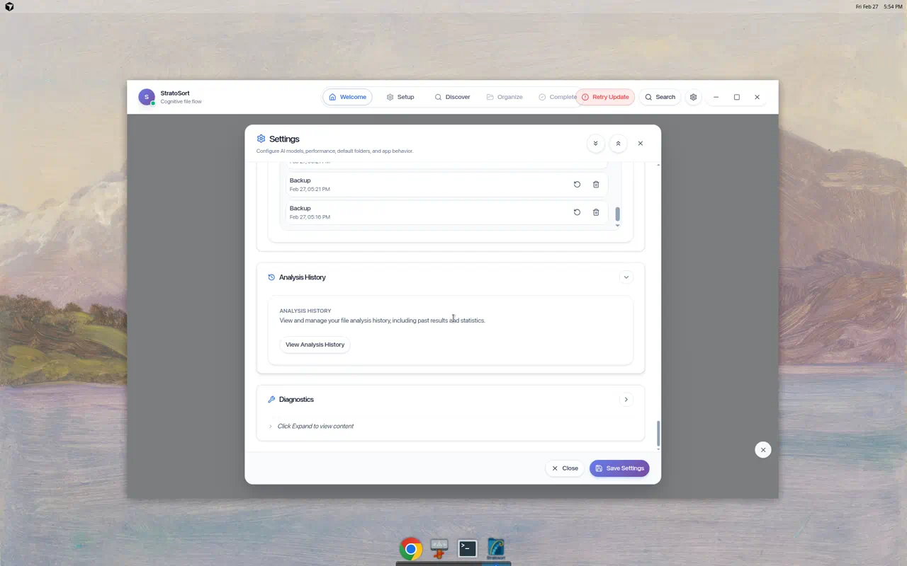

- **View Analysis History** — Opens a viewer showing past analysis results and statistics
- Useful for reviewing what the AI detected and how files were categorized

### 8.6 Diagnostics


#### Troubleshooting Logs
- **Open Folder** — Opens the log directory in your file manager
- **Export Logs** — Creates a log bundle for support tickets

#### Backend API Test
- **Test All APIs** — Runs connectivity checks against all core services (LLM, vector DB,
  file system, etc.)

---

## 9. Videos

Five walkthrough videos were recorded from the production AppImage showing real user
interactions:

| Video | Duration | Contents |
|:------|:---------|:---------|
| `01_welcome_and_setup_walkthrough.mp4` | ~2 min | Welcome screen, "How it works" modal, Setup phase, Add Folder dialog, navigation to Discover |
| `02_discover_phase_walkthrough.mp4` | ~3 min | Naming Strategy modal, Knowledge OS panel, file selection dialog, multi-file import, analysis start |
| `03_discover_analysis_and_model_setup.mp4` | ~3 min | Model download wizard with progress, "Continue with limited AI" bypass, file scanning |
| `04_settings_search_and_navigation.mp4` | ~3 min | Settings panel overview (6 sections), Search widget, Knowledge OS full interface, navigation states |
| `05_settings_deep_dive_and_scan_folder.mp4` | ~12 min | All 6 settings sections expanded with every option visible, Scan Folder feature demonstration |
| `06_organize_and_knowledge_os_demo.mp4` | ~4 min | **Working AI analysis results**, Organize phase with suggestions, Knowledge OS semantic search with real results, batch operations |
| `07_prod_organize_and_knowledge_os.mp4` | ~3 min | Production AppImage: Organize phase, Search widget, Knowledge OS Discover tab searches |
| `08_knowledge_os_all_tabs_complete.mp4` | ~8 min | **All Knowledge OS tabs**: Discover search, Understand (AI chat with RAG), Relate (Knowledge Graph with clusters, insights, legend) |

### Video Transcripts (VoiceOver)

Transcripts for accessibility and audio VoiceOver are in `docs/e2e-transcripts/`. Each transcript
describes the on-screen content in narrative form for recording:

| Transcript | Video |
|:-----------|:------|
| `01_welcome_and_setup_walkthrough.md` | Welcome, How it works modal, Setup, Add Folder, Discover |
| `02_discover_phase_walkthrough.md` | Naming Strategy, Knowledge OS, file selection, analysis start |
| `03_discover_analysis_and_model_setup.md` | Model download wizard, progress bars, Scan Folder |
| `04_settings_search_and_navigation.md` | Search widget, Settings panel, Knowledge OS |
| `05_settings_deep_dive_and_scan_folder.md` | All 6 Settings sections, Scan Folder demo |
| `06_organize_and_knowledge_os_demo.md` | Organize phase, AI suggestions, Knowledge OS search |
| `08_knowledge_os_all_tabs_complete.md` | Discover, Understand, Relate tabs |

---

## Linux-Specific Notes

### Running the AppImage

```bash
# Make executable
chmod +x StratoSortCore-2.0.4-linux-x86_64.AppImage

# Launch
./StratoSortCore-2.0.4-linux-x86_64.AppImage
```

### Models Directory

Models are stored in `~/.config/StratoSort Core/models/` (the `userData` path). The app creates
this directory automatically and downloads models on first launch. Note: The legacy path
`~/.config/stratosort-core/models/` is used by the postinstall script; the running app uses
the `StratoSort Core` path.

### Settings Location

Application settings are stored in `~/.config/StratoSort Core/settings.json`.

### System Tray

On Linux, Background Mode places StratoSort in the system tray. Requires a tray-compatible
desktop environment (GNOME with AppIndicator, KDE, XFCE).
