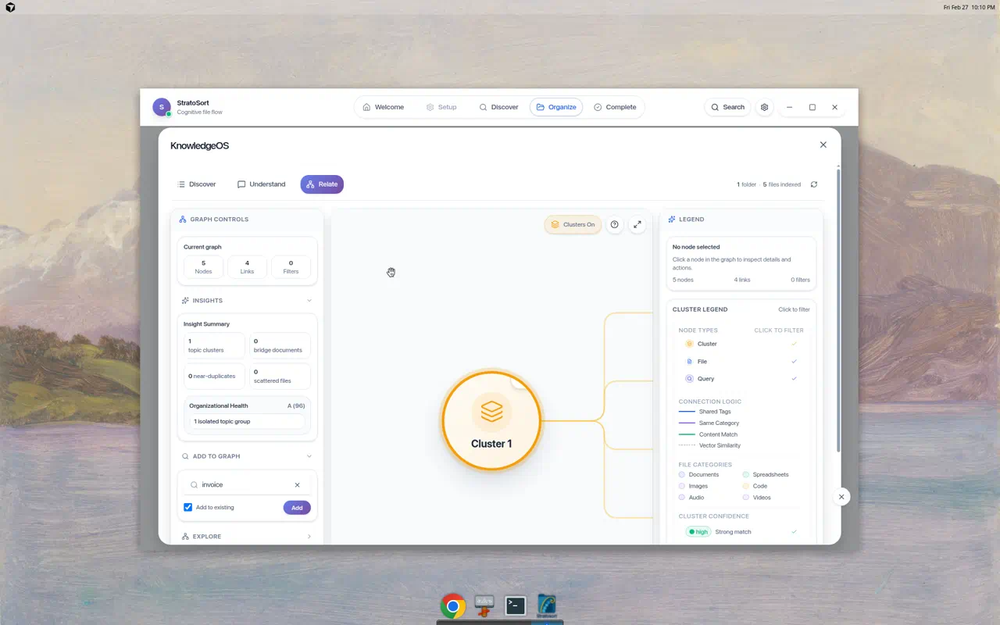

# See StratoSort in Action



## Semantic Search & Chat

Unlock the knowledge hidden in your messy folders. Search implies meaning.



## Knowledge Graph Visualization

Visualize file relationships using the built-in Knowledge OS graph tool to discover clusters and
connections you didn't know existed.

  

